<!doctype html>
<html lang="en">

<head>
  <!-- Required meta tags -->
  <meta charset="utf-8">
  <meta name="viewport" content="width=device-width, initial-scale=1">

  <!-- Bootstrap CSS -->
  <link href="https://cdn.jsdelivr.net/npm/bootstrap@5.0.2/dist/css/bootstrap.min.css" rel="stylesheet"
    integrity="sha384-EVSTQN3/azprG1Anm3QDgpJLIm9Nao0Yz1ztcQTwFspd3yD65VohhpuuCOmLASjC" crossorigin="anonymous">
  
  <title>Documentação</title>
</head>

<body>
  

    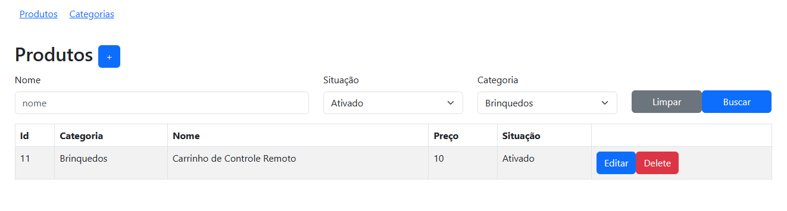
    <h4>Título do projeto</h4>
    
Simulador de Loja

    <h4>Descrição do projeto</h4>
    
O sistema simula uma parte de uma loja online, que terá somente categorias e produtos.

    <h4>Funcionalidades do projeto</h4>
    <ul>
      <li><b>Categoria</b>
        <ul>
          <li>Buscar todas as categorias.</li>
          <li>Filtrar a busca de categorias por nome e situações.</li>
          <li>Criar categoria.</li>
          <li>Atualizar categoria.</li>
          <li>Remover categoria.</li>
        </ul>
      </li>
      <li><b>Produto</b>
        <ul>
          <li>Buscar todos os produtos.</li>
          <li>Filtrar a busca de produtos por nome, categorias e situações.</li>
          <li>Criar produto.</li>
          <li>Atualizar o produto.</li>
          <li>Remover o produto.</li>
        </ul>
      </li>
    </ul>

    <h4>Tecnologias utilizadas</h4>
    <ul>
      <li><b>JAVA v-17</b>
        <ul>
          <li>MAVEN</li>
          <li>Springboot v-3.1.2</li>
          <ul>
            <li>JPA v- last</li>
            <li>postgreesql v- last</li>
            <li>validation v-last</li>
          </ul>
        </ul>
      </li>
    </ul>
    <ul>
      <li>JAVASCRIPT/HTML5/CSS
        <ul>
          <li><b>React v-18.2.0</b>
            <ul>
              <li>react-router-dom v- 6.14.2 </li>
              <li>axios v- 1.4.0</li>
              <li>bootstrap v- 5.3.0</li>
            </ul>
          </li>
        </ul>
    </ul>
    <ul>
      <li><b>PostgreeSQL v-14</b></li>
    </ul>

    </ul>

    <h4>Estrutura de pastas</h4>
    <ul>
      <li><b>admissao</b>, fontes da aplicação backend com maven e JAVA</li>
      <li><b>react</b>, fontes da aplicação frontend com framework React</li>
      <li><b>midia</b>, imagens da documentação</li>
      <li><b>Admissão.postman_collection.json</b>, coleção exportada do postman em json</li>
    </ul>

    <h4>Colaboradores</h4>
    
<b>Desenvolvedor Backend/Frontend: Juliano da silva mendes</b>

    <h4>Status do projeto</h4>
    
Projeto concluído.

    <h4>Inicialização</h4>
    <ul>
      <li><b>Preparar o ambiente de armazenamento com o PostgreeSQL 14</b>
        <ol>
          <li>
            
Caso não tenha instalado o PostgreeSQL, acesse o site oficial para o download <a href="https://www.postgresql.org/download/">https://www.postgresql.org/download/</a>.

          </li>
          <li>
            
Crie um novo servidor

            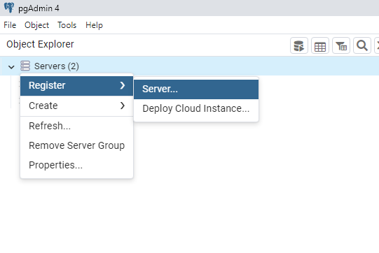
          </li>
          <li>
            
Coloque o nome de PostgreeSQL 14

            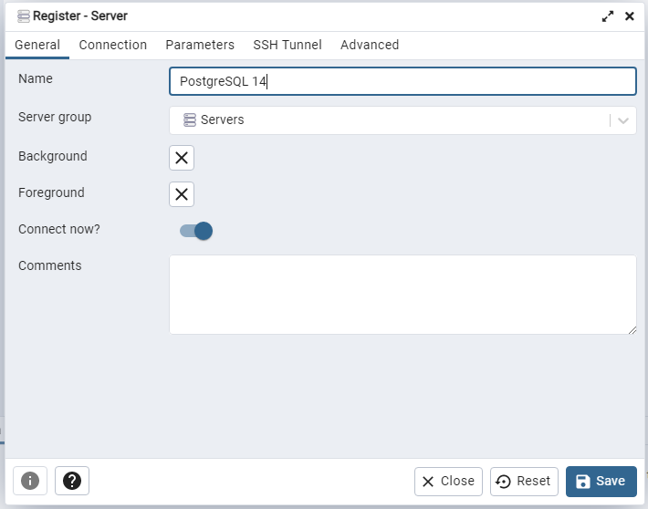
          </li>
          <li>
            
Configure o Host como <code>localhost</code> a porta como <code>5432</code> o administrador como
              <code>postgres</code> e a senha como <code>admin</code>
            

            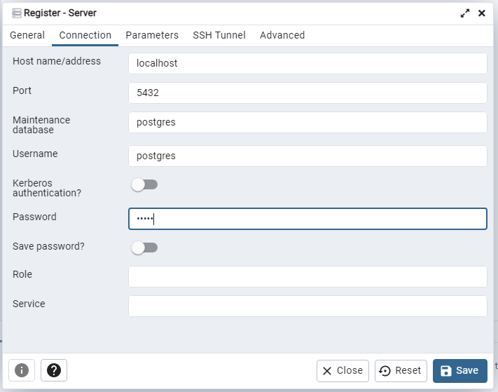
          </li>
          <li>
            
Certifique-se de que seu postgreeSql está na versão 14 e verifique se o servidor foi criado

            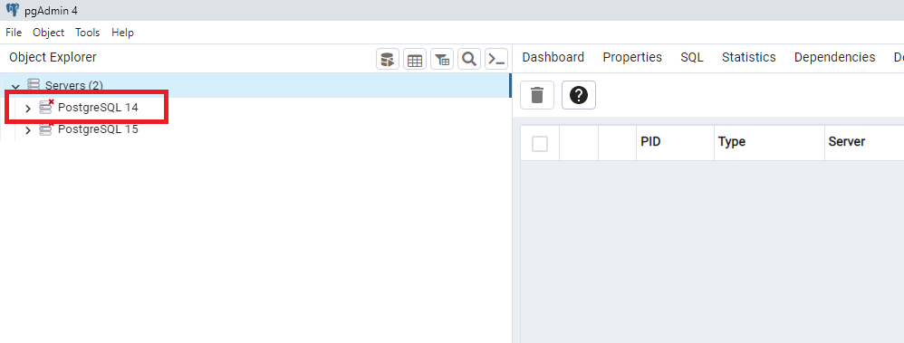
          </li>
          <li>
            
Crie a BASE com o nome admissional

            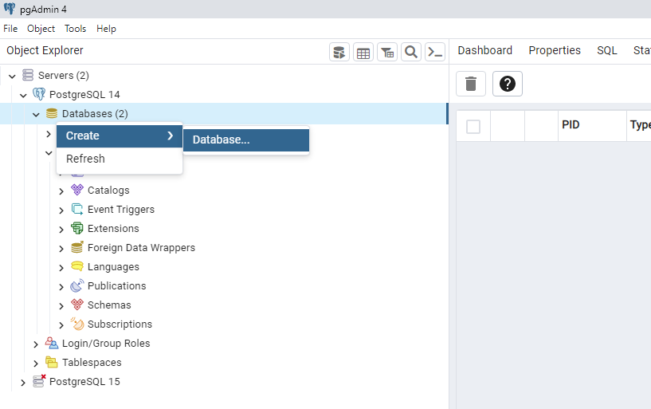

          </li>
          <li>
            
Certifique-se de que a BASE foi criada

            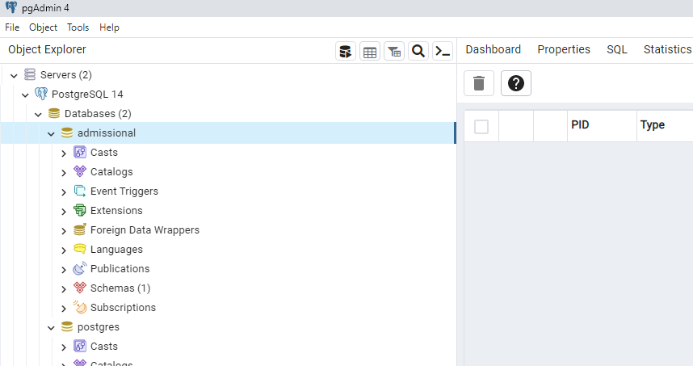
          </li>
          <li>
            
Selecione a BASE, em seguida selecione a aba superior `Tool` e após o menu Query Tool

            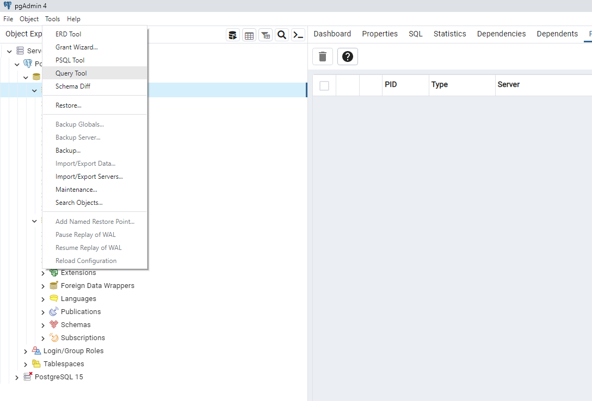
          </li>
          <li>
            
Cole o script abaixo na aba que aparecer e execute clicando no botão com o formato de PLAY

            <code>
              CREATE TABLE categoria ( 
                  id BIGSERIAL PRIMARY KEY, 
                  nome VARCHAR(255), 
                  situacao VARCHAR(255) 
              ); 
               
              CREATE TABLE produto ( 
                  id BIGSERIAL PRIMARY KEY, 
                  categoria_id BIGINT, 
                  descricao VARCHAR(255), 
                  nome VARCHAR(255), 
                  preco DOUBLE PRECISION, 
                  situacao VARCHAR(255) 
              ); 
 
              ALTER TABLE produto 
              ADD FOREIGN KEY (categoria_id) 
              REFERENCES categoria (id);  
            </code>
            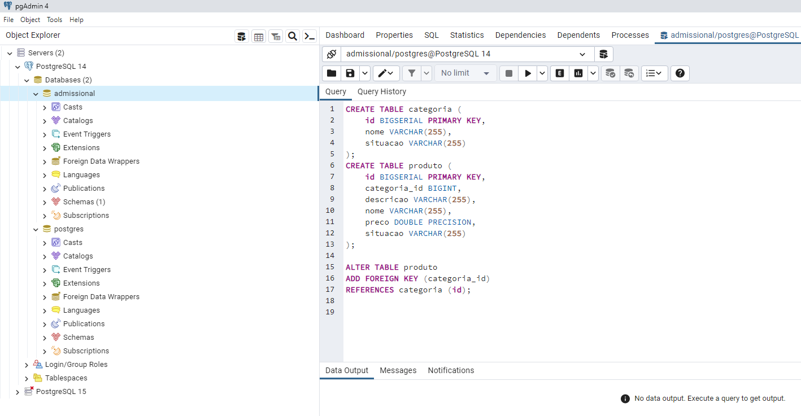
          </li>
          <li>
            
Antes de irmos para o próximo passo, certifique-se de que as tabelas foram criadas

            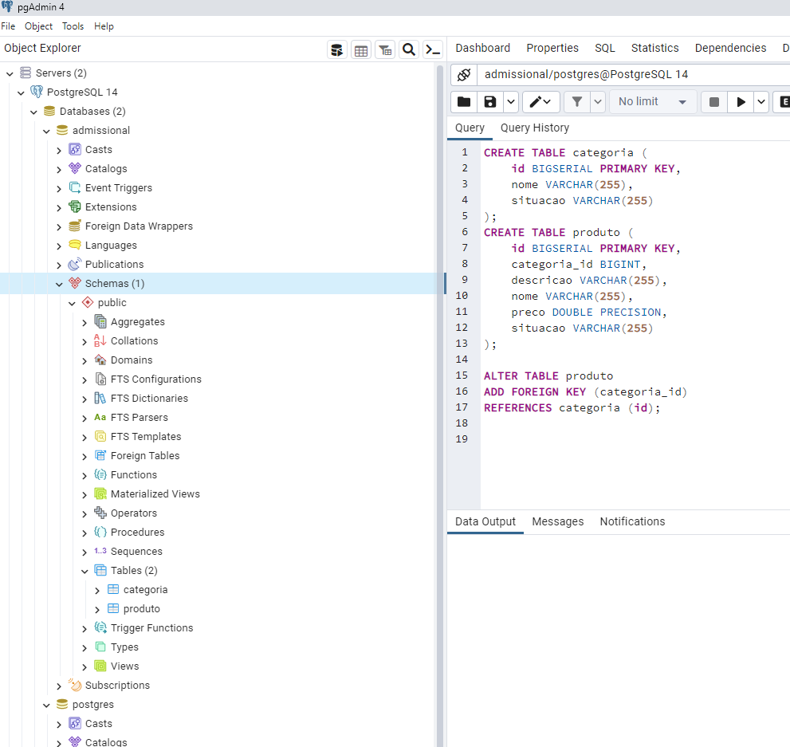
          </li>
        </ol>
      </li>
      <li><b>Executar o JAR</b>
        <ol>
          <li>Para executar o arquivo .jar será nescessário ter instalado a Máquina virtual java com suporte para a versão, que pode ser obtida no seguinte link <a href="https://www.oracle.com/java/technologies/javase/jdk17-archive-downloads.html">https://www.oracle.com/java/technologies/javase/jdk17-archive-downloads.html</a></li>
          <li>
            
Vá para local padrão de construção de porjeto do maven <code>admissao/target</code> e execute o arquivo
              <code>admissao-0.0.1-SNAPSHOT.jar</code>
            

            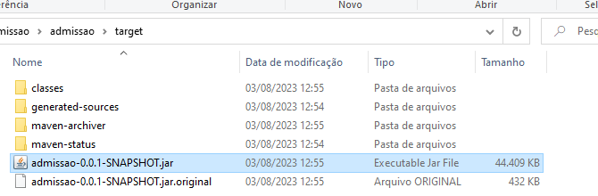
          </li>
          <li>
            
Pode ser que apareça uma alerta de violação de segurança, simplesmente autorize.
            

            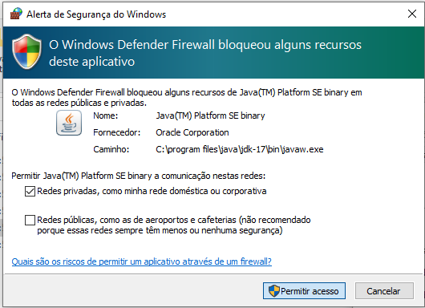
          </li>
          <li>
            
Em seguinda acesse o endereço <code>http://localhost:8080/</code>
              
            

            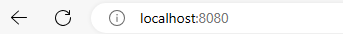
          </li>
        </ol>
    </ul>

    <h4>Extras</h4>
    
Para acessar a exportação dos testes efetuados com o Postman, faça o download do <a href="./Admissão.postman_collection.json" download="filename" target="_blank">ARQUIVO</a> e importe em seu Postman. Caso não tenha o software, acesse o link para fazer download <a href="https://www.postman.com/">https://www.postman.com/</a> e acesse a documentação para saber como importar o arquivo JSON.

<ol>
  <li>
    
Na aplicação clique no botão superior a esquerda chamado import

    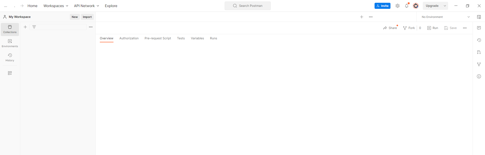
  </li>
  <li>
    
Em seguida clique em selecionar um arquivo

    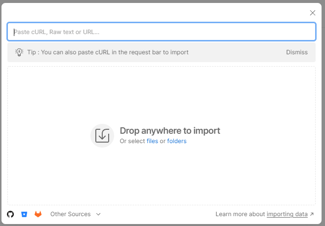
  </li>
  <li>
    
Em seguida selecione o arquivo json

    
  </li>
  <li>
    
Após importar, irá carregar o teste feito com alguns endpoints

    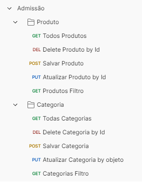
  </li>
</ol>
  

  
  <!-- Option 1: Bootstrap Bundle with Popper -->
  

  <!-- Option 2: Separate Popper and Bootstrap JS -->
  <!--
    
    
    -->
</body>

</html>